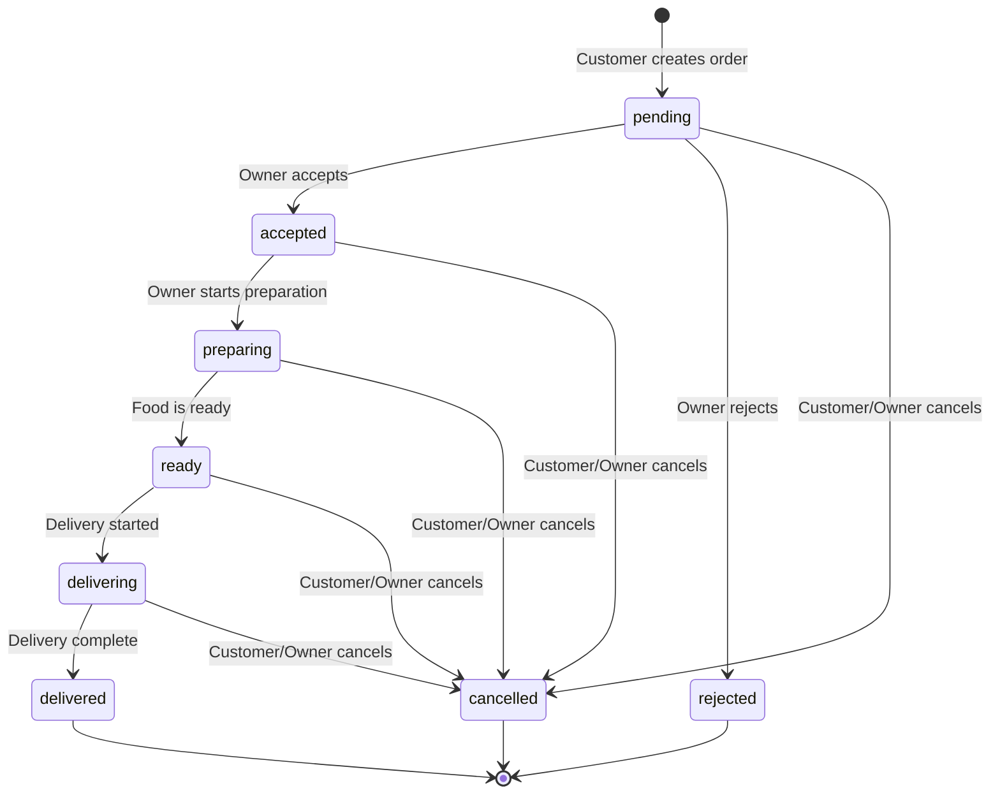

# Order Management API Documentation

## Overview

The Order Management API provides complete functionality for handling food delivery orders on the platform. It enables customers to place orders with multiple dishes and optional voucher codes, while restaurant owners can manage incoming orders through a complete status workflow.

**Base URL**: `/api`

**Authentication**: JWT Bearer Token (except for voucher validation)

---

## Table of Contents

1. [Authentication](#authentication)
2. [API Endpoints](#api-endpoints)
   - [Customer Endpoints](#customer-endpoints)
   - [Restaurant Owner Endpoints](#restaurant-owner-endpoints)
   - [Public Endpoints](#public-endpoints)
3. [Order Status Workflow](#order-status-workflow)
4. [Voucher System](#voucher-system)
5. [Delivery Time Calculation](#delivery-time-calculation)
6. [Error Responses](#error-responses)
7. [Examples](#examples)

---

## Authentication

All protected endpoints require a JWT token in the Authorization header:

```
Authorization: Bearer <token>
```

Tokens are obtained via the `/api/auth/login` endpoint and contain:
- `sub`: User ID
- `role`: Either `customer` or `restaurantOwner`
- `restaurantId`: (for restaurant owners only)
- `exp`: Expiration timestamp

---

## API Endpoints

### Customer Endpoints

#### POST /api/orders

Create a new order.

**Auth Required**: Yes (Customer role)

**Request Body**:
```json
{
  "restaurantId": "uuid-string",
  "items": [
    {
      "dishId": 1,
      "quantity": 2
    },
    {
      "dishId": 2,
      "quantity": 1
    }
  ],
  "voucherCode": "WELCOME10",  // optional
  "customerNotes": "Extra cheese please!"  // optional
}
```

**Validation Rules**:
- `restaurantId`: Required, must exist
- `items`: Required, min 1 item
- `quantity`: Must be 1-99
- All dishes must belong to the same restaurant
- All dishes must be available (not deleted)
- Restaurant must be currently open
- Voucher (if provided) must be valid

**Response** (201 Created):
```json
{
  "id": "uuid-order-id",
  "customerId": "uuid",
  "restaurantId": "uuid",
  "orderStatus": "pending",
  "subtotal": 26.00,
  "discountAmount": 2.60,
  "finalPrice": 23.40,
  "voucherId": 1,
  "voucherCode": "WELCOME10",
  "deliveryStreet": "Teststraße",
  "deliveryHouseNumber": "1",
  "deliveryPostalCode": "1010",
  "deliveryCity": "Wien",
  "estimatedDeliveryMinutes": 35,
  "customerNotes": "Extra cheese please!",
  "createdAt": "2026-01-27T10:30:00.000Z",
  "updatedAt": "2026-01-27T10:30:00.000Z",
  "items": [
    {
      "id": 1,
      "orderId": "uuid",
      "dishId": 1,
      "dishName": "Pizza Margherita",
      "dishPrice": 8.00,
      "quantity": 2,
      "subtotal": 16.00
    },
    {
      "id": 2,
      "orderId": "uuid",
      "dishId": 2,
      "dishName": "Pizza Salami",
      "dishPrice": 10.00,
      "quantity": 1,
      "subtotal": 10.00
    }
  ]
}
```

**Error Responses**:
- `401 Unauthorized`: No token or invalid token
- `403 Forbidden`: User is not a customer
- `404 Not Found`: Restaurant or dish not found
- `409 Conflict`: Restaurant closed, invalid voucher
- `422 Unprocessable Entity`: Validation errors

---

#### GET /api/orders

Get all orders for the authenticated customer.

**Auth Required**: Yes (Customer role)

**Query Parameters**:
- `status` (optional): Filter by order status (pending, accepted, etc.)
- `dateFrom` (optional): ISO date string for date range start
- `dateTo` (optional): ISO date string for date range end
- `limit` (optional): Number of results (pagination)
- `offset` (optional): Offset for pagination

**Example**:
```
GET /api/orders?status=delivered&limit=10&offset=0
```

**Response** (200 OK):
```json
[
  {
    "id": "uuid",
    "customerId": "uuid",
    "restaurantId": "uuid",
    "orderStatus": "delivered",
    "subtotal": 26.00,
    "discountAmount": 2.60,
    "finalPrice": 23.40,
    "estimatedDeliveryMinutes": 35,
    "createdAt": "2026-01-27T10:30:00.000Z",
    "deliveredAt": "2026-01-27T11:10:00.000Z",
    "restaurantName": "Pizza Mario",
    "restaurantStreet": "Kärtner Straße",
    "restaurantHouseNumber": "10",
    "restaurantPostalCode": "1010",
    "restaurantCity": "Wien"
  }
]
```

---

#### GET /api/orders/:id

Get detailed information about a specific order.

**Auth Required**: Yes (Customer role, must be owner of order)

**Response** (200 OK):
```json
{
  "id": "uuid",
  "customerId": "uuid",
  "restaurantId": "uuid",
  "orderStatus": "delivered",
  "subtotal": 26.00,
  "discountAmount": 2.60,
  "finalPrice": 23.40,
  "createdAt": "2026-01-27T10:30:00.000Z",
  "deliveredAt": "2026-01-27T11:10:00.000Z",
  "items": [
    {
      "id": 1,
      "dishName": "Pizza Margherita",
      "dishPrice": 8.00,
      "quantity": 2,
      "subtotal": 16.00
    }
  ],
  "statusHistory": [
    {
      "id": 1,
      "orderId": "uuid",
      "status": "pending",
      "changedAt": "2026-01-27T10:30:00.000Z"
    },
    {
      "id": 2,
      "orderId": "uuid",
      "status": "accepted",
      "changedAt": "2026-01-27T10:32:00.000Z"
    },
    {
      "id": 3,
      "orderId": "uuid",
      "status": "preparing",
      "changedAt": "2026-01-27T10:35:00.000Z"
    },
    {
      "id": 4,
      "orderId": "uuid",
      "status": "ready",
      "changedAt": "2026-01-27T10:50:00.000Z"
    },
    {
      "id": 5,
      "orderId": "uuid",
      "status": "delivering",
      "changedAt": "2026-01-27T10:55:00.000Z"
    },
    {
      "id": 6,
      "orderId": "uuid",
      "status": "delivered",
      "changedAt": "2026-01-27T11:10:00.000Z"
    }
  ]
}
```

**Error Responses**:
- `403 Forbidden`: Order belongs to another customer
- `404 Not Found`: Order not found

---

### Restaurant Owner Endpoints

#### GET /api/restaurants/:restaurantId/orders

Get all orders for a specific restaurant.

**Auth Required**: Yes (Restaurant Owner role, must own the restaurant)

**Query Parameters**: Same as customer GET /api/orders

**Response** (200 OK):
```json
[
  {
    "id": "uuid",
    "customerId": "uuid",
    "restaurantId": "uuid",
    "orderStatus": "pending",
    "subtotal": 26.00,
    "finalPrice": 23.40,
    "deliveryStreet": "Teststraße",
    "deliveryHouseNumber": "1",
    "deliveryPostalCode": "1010",
    "deliveryCity": "Wien",
    "customerNotes": "Extra cheese please!",
    "createdAt": "2026-01-27T10:30:00.000Z",
    "customerFirstName": "Max",
    "customerLastName": "Mustermann",
    "customerEmail": "max.mustermann@test.com"
  }
]
```

**Error Responses**:
- `403 Forbidden`: User does not own this restaurant
- `404 Not Found`: Restaurant not found

---

#### POST /api/orders/:id/accept

Accept a pending order.

**Auth Required**: Yes (Restaurant Owner role, must own the restaurant)

**Request Body**: None

**Response** (200 OK):
```json
{
  "id": "uuid",
  "orderStatus": "accepted",
  "acceptedAt": "2026-01-27T10:32:00.000Z",
  "updatedAt": "2026-01-27T10:32:00.000Z",
  ... (rest of order fields)
}
```

**Error Responses**:
- `403 Forbidden`: User does not own this restaurant
- `404 Not Found`: Order not found
- `409 Conflict`: Order is not in pending status

---

#### POST /api/orders/:id/reject

Reject a pending order.

**Auth Required**: Yes (Restaurant Owner role, must own the restaurant)

**Request Body**:
```json
{
  "reason": "Sorry, we're out of that ingredient"  // optional
}
```

**Response** (200 OK):
```json
{
  "id": "uuid",
  "orderStatus": "rejected",
  "rejectedAt": "2026-01-27T10:32:00.000Z",
  "restaurantNotes": "Sorry, we're out of that ingredient",
  "updatedAt": "2026-01-27T10:32:00.000Z",
  ... (rest of order fields)
}
```

**Error Responses**: Same as accept

---

#### PATCH /api/orders/:id/status

Update order status (for status workflow).

**Auth Required**: Yes (Restaurant Owner role, must own the restaurant)

**Request Body**:
```json
{
  "status": "preparing",  // required
  "notes": "Starting preparation"  // optional
}
```

**Valid Status Values**:
- `preparing`
- `ready`
- `delivering`
- `delivered`
- `cancelled`

**Response** (200 OK):
```json
{
  "id": "uuid",
  "orderStatus": "preparing",
  "preparingStartedAt": "2026-01-27T10:35:00.000Z",
  "restaurantNotes": "Starting preparation",
  "updatedAt": "2026-01-27T10:35:00.000Z",
  ... (rest of order fields)
}
```

**Error Responses**:
- `400 Bad Request`: Status field missing
- `403 Forbidden`: User does not own this restaurant
- `404 Not Found`: Order not found
- `409 Conflict`: Invalid status transition or order in final status

---

### Public Endpoints

#### POST /api/vouchers/validate

Validate a voucher code (no authentication required).

**Auth Required**: No

**Request Body**:
```json
{
  "code": "WELCOME10",  // required
  "restaurantId": "uuid",  // optional
  "orderAmount": 26.00  // optional (for discount preview)
}
```

**Response** (200 OK - Valid):
```json
{
  "valid": true,
  "voucher": {
    "id": 1,
    "code": "WELCOME10",
    "discountType": "percentage",
    "discountValue": 10,
    "isActive": true,
    "validFrom": "2024-01-01T00:00:00.000Z",
    "validUntil": "2030-12-31T23:59:59.000Z",
    "usageLimit": null,
    "usageCount": 5,
    "restaurantId": null
  },
  "message": "Voucher is valid",
  "discountAmount": 2.60,  // only if orderAmount provided
  "finalPrice": 23.40      // only if orderAmount provided
}
```

**Response** (200 OK - Invalid):
```json
{
  "valid": false,
  "voucher": { ... },
  "message": "Voucher has expired"
}
```

**Error Responses**:
- `404 Not Found`: Voucher code does not exist
- `422 Unprocessable Entity`: Code field missing

---

## Order Status Workflow

### Status Flow Diagram



### Valid Transitions

| Current Status | Allowed Next States |
|---------------|---------------------|
| `pending` | `accepted`, `rejected`, `cancelled` |
| `accepted` | `preparing`, `cancelled` |
| `preparing` | `ready`, `cancelled` |
| `ready` | `delivering`, `cancelled` |
| `delivering` | `delivered`, `cancelled` |
| `rejected` | *(final state)* |
| `delivered` | *(final state)* |
| `cancelled` | *(final state)* |

### Timestamps

Each status has an associated timestamp field:

- `createdAt` - Order creation
- `acceptedAt` - Status = accepted
- `rejectedAt` - Status = rejected
- `preparingStartedAt` - Status = preparing
- `readyAt` - Status = ready
- `deliveringStartedAt` - Status = delivering
- `deliveredAt` - Status = delivered
- `updatedAt` - Last update

---

## Voucher System

### Discount Types

1. **Percentage Discount**
   - `discountType: "percentage"`
   - `discountValue`: e.g., 10 for 10%
   - Calculation: `subtotal * (discountValue / 100)`

2. **Fixed Amount Discount**
   - `discountType: "fixed_amount"`
   - `discountValue`: e.g., 5 for 5€
   - Calculation: `min(discountValue, subtotal)` (never more than order total)

### Voucher Validation Logic

A voucher is valid if ALL of the following are true:

1. ✅ Code exists in database
2. ✅ `isActive = true`
3. ✅ Current time >= `validFrom`
4. ✅ Current time <= `validUntil`
5. ✅ `usageCount < usageLimit` (or usageLimit is NULL)
6. ✅ If voucher has `restaurantId`, it must match order's restaurant

### Restaurant-Specific vs Global Vouchers

- **Global Voucher**: `restaurantId = NULL` → Valid for all restaurants
- **Restaurant-Specific**: `restaurantId = <uuid>` → Valid only for that restaurant

### Usage Tracking

- Each time a voucher is used in an order, `usageCount` is incremented
- If `usageLimit` is reached, voucher becomes invalid
- Example: MARIO20 has `usageLimit = 5`, after 5 uses it's invalid

---

## Delivery Time Calculation

The estimated delivery time is calculated using the following algorithm:

```
1. Find the longest cooking_time_minutes among all ordered dishes
   Example: Pizza (15 min), Pasta (20 min) → Max = 20 min

2. Check if current time is rush hour (17:00-19:00)
   If yes: Add random 5-10 minutes

3. Add flat delivery time: +10 minutes

Final Formula:
estimatedDeliveryMinutes = maxCookingTime + rushHourBonus + 10
```

### Example Calculation

**Order placed at 18:30** (rush hour):
- Dish 1: Pizza Margherita (15 min)
- Dish 2: Spaghetti Carbonara (20 min)

Calculation:
```
Max cooking time: 20 min
Rush hour bonus: +7 min (random 5-10)
Delivery time: +10 min
-------------------
Total: 37 minutes
```

**Order placed at 14:00** (no rush hour):
```
Max cooking time: 20 min
Rush hour bonus: 0 min
Delivery time: +10 min
-------------------
Total: 30 minutes
```

---

## Error Responses

### Standard Error Format

All errors follow this format:

```json
{
  "error": "Error message",
  "errors": ["Detail 1", "Detail 2"]  // Optional, for validation errors
}
```

### HTTP Status Codes

| Code | Meaning | Usage |
|------|---------|-------|
| `400` | Bad Request | Missing required fields in request |
| `401` | Unauthorized | No token or invalid token |
| `403` | Forbidden | User lacks permission for this resource |
| `404` | Not Found | Resource does not exist |
| `409` | Conflict | Business rule violation (e.g., restaurant closed) |
| `422` | Unprocessable Entity | Validation errors |
| `500` | Internal Server Error | Unexpected server error |

### Common Error Scenarios

#### 422 Validation Errors

```json
{
  "error": "Validation failed",
  "errors": [
    "Item 1: Quantity must be between 1 and 99",
    "At least one item is required",
    "All dishes must belong to the same restaurant"
  ]
}
```

#### 409 Conflict Examples

**Restaurant Closed**:
```json
{
  "error": "Restaurant is closed"
}
```

**Invalid Status Transition**:
```json
{
  "error": "Invalid status transition from delivered to preparing"
}
```

**Order in Final Status**:
```json
{
  "error": "Order is already in final status"
}
```

#### 403 Forbidden

```json
{
  "error": "You do not have permission to view this order"
}
```

---

## Examples

### Complete Order Flow Example

#### 1. Customer Creates Order

```http
POST /api/orders
Authorization: Bearer <customer-token>
Content-Type: application/json

{
  "restaurantId": "abc-123",
  "items": [
    { "dishId": 1, "quantity": 2 },
    { "dishId": 3, "quantity": 1 }
  ],
  "voucherCode": "WELCOME10",
  "customerNotes": "Please ring doorbell"
}
```

**Response**: Order created with status `pending`, discount applied

---

#### 2. Owner Views Pending Orders

```http
GET /api/restaurants/abc-123/orders?status=pending
Authorization: Bearer <owner-token>
```

**Response**: List of pending orders including the new one

---

#### 3. Owner Accepts Order

```http
POST /api/orders/xyz-456/accept
Authorization: Bearer <owner-token>
```

**Response**: Order status changed to `accepted`

---

#### 4. Owner Updates Status Through Workflow

```http
PATCH /api/orders/xyz-456/status
Authorization: Bearer <owner-token>
Content-Type: application/json

{ "status": "preparing" }
```

```http
PATCH /api/orders/xyz-456/status
{ "status": "ready" }
```

```http
PATCH /api/orders/xyz-456/status
{ "status": "delivering" }
```

```http
PATCH /api/orders/xyz-456/status
{ "status": "delivered" }
```

---

#### 5. Customer Views Order History

```http
GET /api/orders/xyz-456
Authorization: Bearer <customer-token>
```

**Response**: Complete order with all items and status history

---

### Voucher Validation Example

```http
POST /api/vouchers/validate
Content-Type: application/json

{
  "code": "MARIO20",
  "restaurantId": "abc-123",
  "orderAmount": 50.00
}
```

**Response**:
```json
{
  "valid": true,
  "voucher": {
    "code": "MARIO20",
    "discountType": "percentage",
    "discountValue": 20
  },
  "message": "Voucher is valid",
  "discountAmount": 10.00,
  "finalPrice": 40.00
}
```

---

## Testing

### Using Postman

1. Import the collection from `backend/postman/Order-Management-API.postman_collection.json`
2. Import environment from `backend/postman/Development.postman_environment.json`
3. Run seed script: `npm run seed:orders`
4. Start server: `npm run dev`
5. Execute requests in order: Setup → Customer → Owner flows

See `backend/postman/README.md` for detailed testing guide.

### Test Credentials

After running `npm run seed:orders`:

**Customers**:
- max.mustermann@test.com / Test1234!
- anna.schmidt@test.com / Test1234!

**Restaurant Owners**:
- owner@pizzamario.com / Test1234!
- owner@burgerpalace.com / Test1234!

**Vouchers**:
- WELCOME10 - 10% global discount
- MARIO20 - 20% for Pizza Mario only (limit 5)
- EXPIRED2025 - Expired voucher (for testing)

---

## Implementation Notes

### Architecture

- **Repository Pattern**: All database access through repository classes
- **Business Logic**: All validation and business rules in service classes
- **Controllers**: Thin layer handling HTTP requests/responses only
- **Error Handling**: Centralized error middleware with custom error classes

### Security

- All passwords hashed with Argon2id
- JWT tokens for authentication
- Role-based authorization (customer vs restaurant_owner)
- Backend validation for all inputs (frontend validation is UX only)
- SQL injection prevention via prepared statements

### Data Integrity

- **Order Snapshots**: Dish names, prices, and delivery addresses are stored as snapshots to prevent data inconsistency if source data changes
- **Status History**: Complete audit trail of all status changes with timestamps
- **Voucher Atomicity**: Usage count incremented atomically to prevent race conditions

---

## Support

For issues or questions:
1. Check server logs for detailed error messages
2. Verify database migrations are up to date
3. Ensure test data was seeded properly
4. Review Postman tests for expected behavior

---

**Last Updated**: 2026-01-27
**API Version**: 1.0.0
