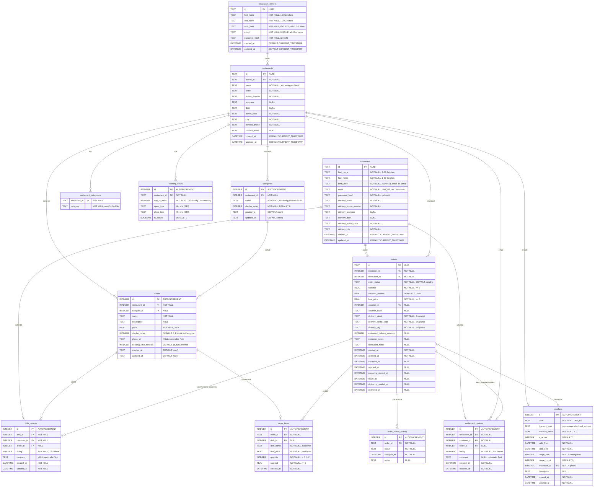

# Food Delivery Platform - Datenbankmodell

## Übersicht

Dieses Dokument beschreibt das vollständige Datenbankschema der Food-Delivery-Plattform.

## Entity-Relationship Diagram (Mermaid)



## Datenbanktyp

**SQLite** - Eingebettete relationale Datenbank

## Wichtige Constraints und Validierungen

### Unique Constraints
- `customers.email` - Case-insensitive unique
- `restaurant_owners.email` - Case-insensitive unique
- `restaurants.name + city` - Restaurantname muss pro Stadt eindeutig sein
- `categories.restaurant_id + name` - Kategoriename muss pro Restaurant eindeutig sein
- `vouchers.code` - Case-insensitive unique
- `restaurant_reviews.restaurant_id + customer_id + order_id` - Ein Review pro Kunde pro Bestellung pro Restaurant
- `dish_reviews.dish_id + customer_id + order_id` - Ein Review pro Kunde pro Bestellung pro Gericht

### Check Constraints
- **Altersvalidierung** (Business Logic):
  - Kunden: Mindestens 16 Jahre (konfigurierbar im Server-Config-File)
  - Restaurantbesitzer: Mindestens 18 Jahre (konfigurierbar im Server-Config-File)
- **Namensvalidierung** (Backend):
  - Vorname, Nachname: 1-30 Zeichen
  - Keine Zahlen, nur Bindestrich und Punkt als Sonderzeichen
- **Restaurantname-Validierung** (Backend):
  - Nur Punkt, Bindestrich, Schrägstrich, Zahlen und Buchstaben
- **E-Mail-Validierung** (Backend): Muss gültige E-Mail-Adresse sein
- **Preis-Constraints**:
  - `dishes.price >= 0`
  - `orders.subtotal >= 0`
  - `orders.discount_amount >= 0`
  - `orders.final_price >= 0`
  - `order_items.dish_price >= 0`
  - `order_items.subtotal >= 0`
- **Mengen-Constraints**:
  - `order_items.quantity > 0`
  - `dishes.cooking_time_minutes > 0`
  - `vouchers.usage_count >= 0`
- **Bewertungs-Constraints**:
  - `restaurant_reviews.rating BETWEEN 1 AND 5`
  - `dish_reviews.rating BETWEEN 1 AND 5`
- **Status-Constraints**:
  - `orders.order_status` IN (pending, accepted, rejected, preparing, ready, delivering, delivered, cancelled)
  - `vouchers.discount_type` IN (percentage, fixed_amount)

### Foreign Key Constraints
- Alle Fremdschlüssel mit `ON DELETE CASCADE` oder `ON DELETE SET NULL` je nach Geschäftslogik
- `restaurants.owner_id` → `restaurant_owners.id` (CASCADE)
- `restaurant_categories.restaurant_id` → `restaurants.id` (CASCADE)
- `opening_hours.restaurant_id` → `restaurants.id` (CASCADE)
- `categories.restaurant_id` → `restaurants.id` (CASCADE)
- `dishes.restaurant_id` → `restaurants.id` (CASCADE)
- `dishes.category_id` → `categories.id` (SET NULL)
- `orders.customer_id` → `customers.id` (CASCADE)
- `orders.restaurant_id` → `restaurants.id` (CASCADE)
- `orders.voucher_id` → `vouchers.id` (SET NULL)
- `order_items.order_id` → `orders.id` (CASCADE)
- `order_items.dish_id` → `dishes.id` (SET NULL)

### Indizes für Performance

#### Authentifizierung
- `idx_customers_email` - Case-insensitive Email-Suche
- `idx_restaurant_owners_email` - Case-insensitive Email-Suche

#### Restaurants
- `idx_restaurants_name_city` - Unique Index für Name+Stadt
- `idx_opening_hours_restaurant` - Öffnungszeiten-Lookup

#### Menü
- `idx_categories_restaurant_order` - Kategorien sortiert nach display_order
- `idx_dishes_category_order` - Gerichte sortiert nach display_order
- `idx_dishes_restaurant` - Gerichte pro Restaurant

#### Bestellungen
- `idx_orders_customer` - Bestellungen eines Kunden
- `idx_orders_restaurant` - Bestellungen eines Restaurants
- `idx_orders_status` - Bestellungen nach Status
- `idx_orders_created` - Bestellungen chronologisch
- `idx_orders_restaurant_created` - Kombinierter Index für Analytics
- `idx_order_items_order` - Order Items einer Bestellung
- `idx_order_items_dish` - Welche Bestellungen ein Gericht enthält
- `idx_order_status_history_order_time` - Status-Historie chronologisch

#### Bewertungen
- `idx_restaurant_reviews_restaurant` - Reviews pro Restaurant
- `idx_restaurant_reviews_customer` - Reviews eines Kunden
- `idx_dish_reviews_dish` - Reviews pro Gericht
- `idx_dish_reviews_customer` - Dish Reviews eines Kunden

#### Vouchers
- `idx_vouchers_code` - Unique case-insensitive Voucher-Code Lookup

## Datenbankfeatures

### Automatische Timestamps
- Alle Haupttabellen haben `created_at` und `updated_at` Felder
- Trigger für automatisches Update von `updated_at` bei:
  - `orders`
  - `vouchers`
  - `restaurant_reviews`
  - `dish_reviews`

### Snapshot-Daten in Bestellungen
- Lieferadresse des Kunden wird in `orders` kopiert (keine Referenz)
- Gerichtname und -preis werden in `order_items` kopiert
- Garantiert historische Korrektheit auch wenn Daten später geändert werden

### Soft References
- `order_items.dish_id` ist nullable (SET NULL bei Löschung)
- Ermöglicht Löschen von Gerichten ohne Bestellhistorie zu verlieren

## Geschäftslogik-Features

### Lieferzeitberechnung
Basis für `orders.estimated_delivery_minutes`:
1. Längste `cooking_time_minutes` aller Gerichte in der Bestellung
2. +5-10 Minuten zwischen 17:00-19:00 Uhr (Stoßzeiten)
3. +10 Minuten pauschale Lieferzeit

### Bestellstatus-Workflow
```
pending → accepted/rejected
   ↓
accepted → preparing → ready → delivering → delivered
```

Alle Status-Änderungen werden in `order_status_history` protokolliert.

### Warenkorb-Logik
- Nur Gerichte von **einem** Restaurant gleichzeitig
- Validierung erfolgt beim Checkout im Backend
- Frontend speichert Warenkorb lokal

### Voucher-System
- **Prozentual**: z.B. 10% Rabatt
- **Fixer Betrag**: z.B. -5€ Rabatt
- Optional restaurant-spezifisch oder global
- Nutzungslimit (NULL = unbegrenzt)
- Gültigkeitszeitraum

### Bewertungssystem
- Restaurant-Bewertungen (1-5 Sterne + optionaler Text)
- Gericht-Bewertungen (1-5 Sterne + optionaler Text)
- Ein Review pro Kunde pro Bestellung (verhindert Spam)
- Optional verknüpft mit Bestellung

### Analytics-Unterstützung
Die Struktur ermöglicht:
- Anzahl Bestellungen täglich/wöchentlich
- Meistbestellte Gerichte in Zeitraum
- Umsatz-Analysen
- Bewertungs-Trends

## Anforderungsabdeckung

### ✅ Authentifizierung & Registrierung
- [x] Kunden-Registrierung mit allen erforderlichen Feldern
- [x] Restaurantbesitzer-Registrierung mit allen erforderlichen Feldern
- [x] Passwort-Hashing (password_hash)
- [x] E-Mail als Benutzername (unique, case-insensitive)
- [x] Altersvalidierung (16/18 Jahre, konfigurierbar)
- [x] Namensvalidierung (1-30 Zeichen, nur Bindestrich/Punkt)
- [x] Adressfelder (Straße, Nummer, Stiege, Tür, PLZ, Ort)

### ✅ Restaurant-Verwaltung
- [x] Restaurant-Kategorien/Küchenarten (aus Config)
- [x] Eindeutiger Name pro Stadt
- [x] Öffnungszeiten pro Wochentag
- [x] Kontaktinformationen
- [x] Restaurant-Profil editierbar

### ✅ Menü-Management
- [x] Kategorien mit Reihenfolge (display_order)
- [x] Gerichte mit Name, Beschreibung, Preis
- [x] Optionales Foto (photo_url)
- [x] Optional Kategorie-Zuordnung
- [x] Display Order/Priorität pro Gericht
- [x] Kochzeit pro Gericht (für Lieferzeitberechnung)

### ✅ Bestellungen
- [x] Kunde kann bestellen
- [x] Nur ein Restaurant pro Warenkorb (Frontend-Validierung)
- [x] Mengenauswahl (1-X)
- [x] Voucher-System (prozentual/fixer Betrag)
- [x] Bestellstatus-Tracking
- [x] Status-Historie
- [x] Geschätzte Lieferzeit
- [x] Bestellung annehmen/ablehnen (Restaurant)
- [x] Status-Updates (preparing, ready, delivering, delivered)

### ✅ Bewertungen
- [x] Restaurant-Bewertungen (Sterne + Text)
- [x] Gericht-Bewertungen (Sterne + Text)
- [x] Verknüpfung mit Bestellung (optional)
- [x] Ein Review pro Kunde pro Bestellung

### ✅ Analytics
- [x] Bestellungen nach Zeitraum (created_at Index)
- [x] Meistbestellte Gerichte (order_items.dish_id)
- [x] Restaurant-spezifische Analysen (idx_orders_restaurant_created)

## Migrations-Dateien

Das Schema wird über folgende SQL-Migrations-Dateien aufgebaut:

1. **001_initial_schema.sql** - Migrations-Tracking-Tabelle
2. **002_authentication_tables.sql** - Kunden, Restaurantbesitzer, Restaurants, Kategorien, Öffnungszeiten
3. **003_menu_tables.sql** - Menü-Kategorien und Gerichte
4. **004_rename_dish_priority_to_display_order.sql** - Umbenennung für Konsistenz
5. **005_orders_and_reviews_system.sql** - Bestellungen, Vouchers, Bewertungen

Alle Migrations werden über den Migration Runner im Backend automatisch ausgeführt.

## Viewer-Kompatibilität

Diese Datei kann in folgenden Tools visualisiert werden:

- **GitHub**: Zeigt Mermaid-Diagramme nativ an
- **VS Code**: Mit "Markdown Preview Mermaid Support" Extension
- **Online**: [mermaid.live](https://mermaid.live/), [mermaid-js.github.io](https://mermaid-js.github.io/mermaid-live-editor/)
- **JetBrains IDEs**: Mit Mermaid Plugin
- **Obsidian**: Native Mermaid-Unterstützung

---

**Stand**: Januar 2026  
**Datenbankversion**: Migration 005 (Orders and Reviews System)
